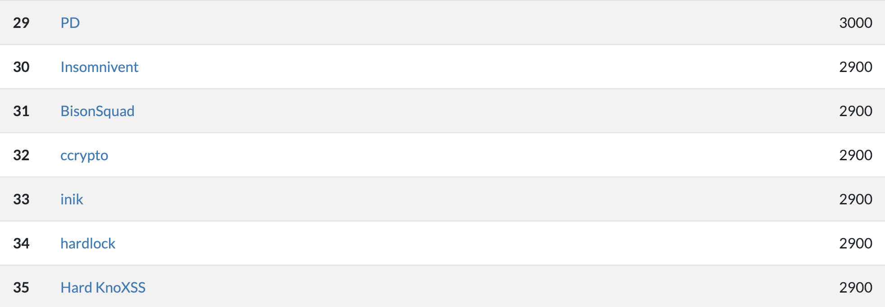

# CodeMash 2019

Our first group CTF effort. We were able to complete every remote challenge and tying for 30th place.



Not a bad start. 

## 100s Easy Peasy

Typically these challenges will revolve around data conversion, trivia, or some simple programming example. In some case, all three. We won't be going in depth into these as they don't require a ton of explaining, but there are a few things to keep in mind:

* Ascii Art - Use an ascii table
* Esoteric Stuff - The *Ook* hint isn't for show. It's a programming language similar to `BrainFuck`. Use a translator
* Unicorn - Crack open your favorite SVG editor to analyze the file type. It's common in steganography challenges to bury flags within metadata of an image, on in this case, layers of the image itself.
* Capture the Flag - "This falg is easy to catch, isn't it? Shift your text accordingly.
```
fl
ag
```

